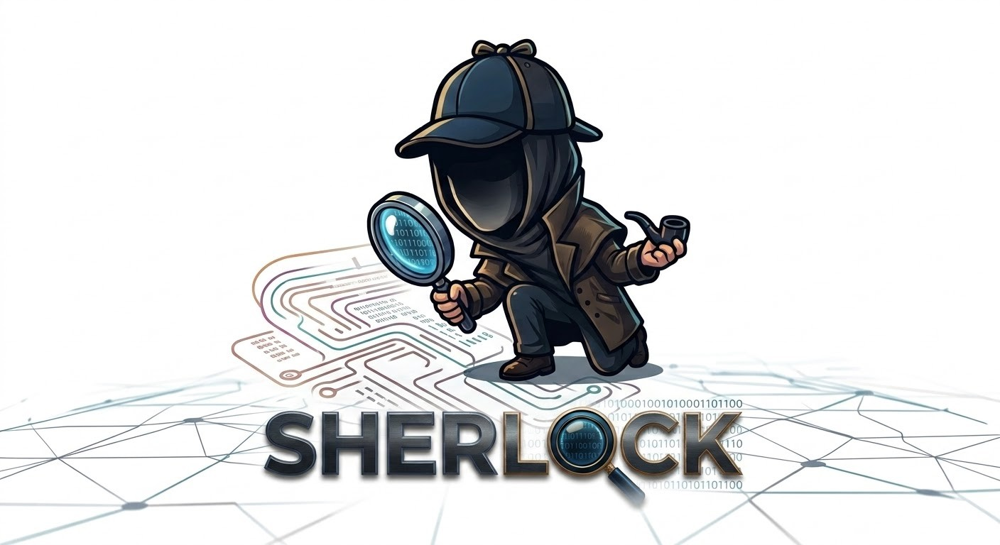

<p align="center">
  
</p>

# SHERLOCK - Threat Hunting Tool

SHERLOCK is an autonomous threat-hunting platform for SOC analysts. An analyst submits a
hypothesis or the name of an attack campaign; an LLM-driven agent enriches it into IOCs,
generates and runs read-only queries across **Microsoft Sentinel**, **Microsoft
Defender** and **Google SecOps**, analyzes the results in a loop, and delivers an
investigation report with a timeline and a findings dashboard.

The agent investigates; the analyst decides. SHERLOCK is built around a few
non-negotiable guarantees, enforced in code rather than merely prompted:

- **Read-only by construction.** No write/response tool is ever exposed to the model - no
  host isolation, account disablement or rule editing. Read-only is material (minimal API
  permissions, no write tools in the codebase), not an instruction to the model.
- **Minimization before the model.** The middleware selects, masks, aggregates and caps
  every result before it reaches the LLM. Internal identifiers (hosts, accounts, private
  IPs, personal fields) are tokenized into stable per-hunt pseudonyms (`HOST-001`), with a
  second semantic pass (a local anonymization model) as defense in depth - fail-closed if
  that model is unreachable. The mapping table never leaves the platform.
- **No IOC from model memory.** Every IOC must come from a real lookup on an approved
  threat-intel source and carry its source; an unsourced IOC is rejected by code.
- **Human verdict.** Three human checkpoints frame the loop: IOC validation, playbook &
  budget validation, and report validation.
- **Untrusted content is data, never instructions.** SIEM results and threat-intel pages
  are wrapped in explicit delimiters and treated as untrusted input.

## How it works

1. **New hunt** - a free-text hypothesis or a campaign name (optionally with known IOCs,
   entered by hand or imported from a `.txt` / `.csv` / `.xlsx` file).
2. **IOC validation** - a blocking human checkpoint; nothing is queried until the analyst
   validates.
3. **Playbook** - the agent proposes an ordered plan (per SIEM, objective, ATT&CK
   technique, expected queries) and an estimate; the analyst validates or adjusts the
   budgets.
4. **Investigation loop** - the agent generates a query, the middleware runs it read-only
   under strict caps, minimizes and anonymizes the result, and the agent reasons and
   pivots until it concludes.
5. **Report** - cover page, the attack it hunted (with MITRE ATT&CK), the validated
   playbook, findings tied to the queries that prove them, timeline, execution journal,
   and a proposed verdict the analyst confirms.

An interrupted hunt keeps its execution state and can be **continued where it stopped**,
or **resumed** as a new linked investigation with a follow-up question.

## The AI gateway (bring your own model)

SHERLOCK talks to any **OpenAI-compatible** endpoint with native function calling. Point
it at OpenAI, Azure OpenAI, a self-hosted server (Ollama, vLLM, LM Studio), or any
compatible gateway - set the base URL, enter your API key in the Configuration screen, and
choose your model IDs. Two model roles are used (analysis and query generation); they can
be the same model. The requirement is that the model supports tool/function calling.

The **anonymization model** is a second endpoint used for the semantic masking pass
(`SHL_ANONYMIZER_BASE_URL` + `SHL_ANONYMIZER_MODEL`, key in the Configuration screen). Any
OpenAI-compatible chat-completions endpoint works: a model you host (Ollama, vLLM, LM Studio),
the same gateway as the reasoning model, or a hosted model behind an OpenAI-compatible
facade. Leave the URL empty to reuse the gateway; set `SHL_SEMANTIC_ANONYMIZATION=false` to
disable the pass (the deterministic tokenization layer still runs).

Choose it knowingly: the reasoning model only ever receives pseudonyms, but the
anonymization pass is the one step that reads free-text fields *before* they are fully
masked - its job is to catch the residue the patterns missed (a name in a comment, a host in
an unexpected format). Whatever you point it at sees that residue. A model you host, or one
covered by a no-retention agreement you trust with raw data, is the right choice; a public
API is not. The pass is fail-closed by default: if the model is unreachable, free-text fields
are masked rather than sent.

Validate a candidate before adopting it - recall on trapped log lines, false positives and
resistance to a hostile log entry:

```bash
.venv/bin/python scripts/bench_anonymizer.py --models "my-model-id"
```

## Stack

- **Backend** - Python 3.11+, FastAPI, Pydantic v2, SQLAlchemy (async, SQLite).
- **Frontend** - React 18, TypeScript, Vite, Tailwind CSS, TanStack Query, SSE for the
  live hunt feed.
- **Auth** - local accounts managed by an admin (PBKDF2, httpOnly session cookie); an SSO
  path is left for adopters to wire in.

## Getting started

```bash
# backend
python3 -m venv .venv && .venv/bin/pip install -e .
# reproducible install with the tested, pinned versions instead:
#   .venv/bin/pip install -r requirements.txt && .venv/bin/pip install --no-deps -e .
cp .env.example .env            # set the gateway URL, model IDs, internal DNS suffixes...
.venv/bin/python scripts/create_account.py <username> --roles analyst,admin
.venv/bin/uvicorn api.app:create_app --factory --app-dir src --reload

# frontend
cd web && npm install && npm run dev
```

API keys (gateway, anonymizer, SIEM identities, threat intel) are entered in the
**Configuration** screen and stored in an encrypted secret store - never in `.env`, never
readable back through the API.

Deployment notes (systemd + nginx) are in `docs/deployment.md`. Design and architecture
references live in `docs/`.

## Documentation

- `docs/architecture.md` - architecture and guard-rails.
- `docs/tools-spec.md` - the closed set of tools exposed to the agent.
- `docs/frontend-spec.md` - screens, visual direction, browser-security constraints.
- `docs/web-search-security.md` - the open-search / egress model.

## Third-party services

SHERLOCK does not bundle or redistribute any external service: you bring your own
accounts, subscriptions and API keys, and each service is used under **its own terms of
service and pricing**, which you are responsible for complying with. Some free tiers are
limited to non-commercial use or rate-limited; check before relying on a source in
production.

| Service | Used for | Terms / pricing |
|---|---|---|
| Microsoft Sentinel (Azure Monitor Logs API) | SIEM queries, read-only | [API overview](https://learn.microsoft.com/azure/azure-monitor/logs/api/overview), your Azure subscription |
| Microsoft Defender (Microsoft Graph security API) | Advanced Hunting queries, read-only | [runHuntingQuery](https://learn.microsoft.com/graph/api/security-security-runhuntingquery), your Microsoft 365 licensing |
| Google SecOps / Chronicle API | UDM searches, read-only | [Chronicle API](https://cloud.google.com/chronicle/docs/reference/rest), your Google SecOps subscription |
| VirusTotal API | IOC enrichment | [Terms of service](https://www.virustotal.com/gui/terms-of-service), [public vs premium API](https://docs.virustotal.com/reference/public-vs-premium-api) - the free public API is non-commercial and rate-limited |
| AlienVault OTX | IOC enrichment | [otx.alienvault.com](https://otx.alienvault.com/) - free API key |
| ThreatFox (abuse.ch) | IOC enrichment | [threatfox.abuse.ch](https://threatfox.abuse.ch/api/), [abuse.ch legal](https://abuse.ch/legal/) |
| CIRCL MISP OSINT feed | IOC enrichment, keyless | [CIRCL OSINT feed](https://www.circl.lu/doc/misp/feed-osint/) |
| Tavily Search API | Publisher-report search (optional) | [tavily.com](https://tavily.com/) - free tier, paid plans |
| Brave Search API | Publisher-report search (optional) | [brave.com/search/api](https://brave.com/search/api/) - paid |
| Google Programmable Search | Publisher-report search (optional) | [Custom Search JSON API](https://developers.google.com/custom-search/v1/overview) - limited free quota |
| LLM gateway (any OpenAI-compatible provider) | Reasoning and query generation | your provider's terms and token pricing |
| Azure Key Vault (optional) | Secret storage | [Key Vault pricing](https://azure.microsoft.com/pricing/details/key-vault/) |

## Security

Threat-intel pages and SIEM results can carry hostile text. SHERLOCK treats all external
content as untrusted data, wraps it in delimiters, and never builds a tool call from an
extracted string without schema validation. If you find a vulnerability, please open a
private report rather than a public issue.

## License

Apache License 2.0 - see [LICENSE](LICENSE) and [NOTICE](NOTICE).

Third-party dependencies (Python packages in `pyproject.toml` / `requirements.txt`,
npm packages in `web/package.json`) are distributed under their own licenses, which
remain applicable to them.
