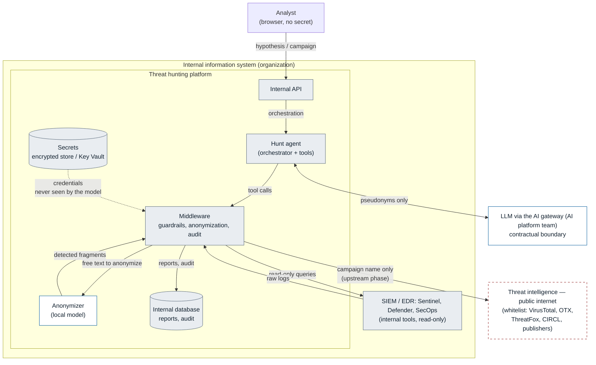
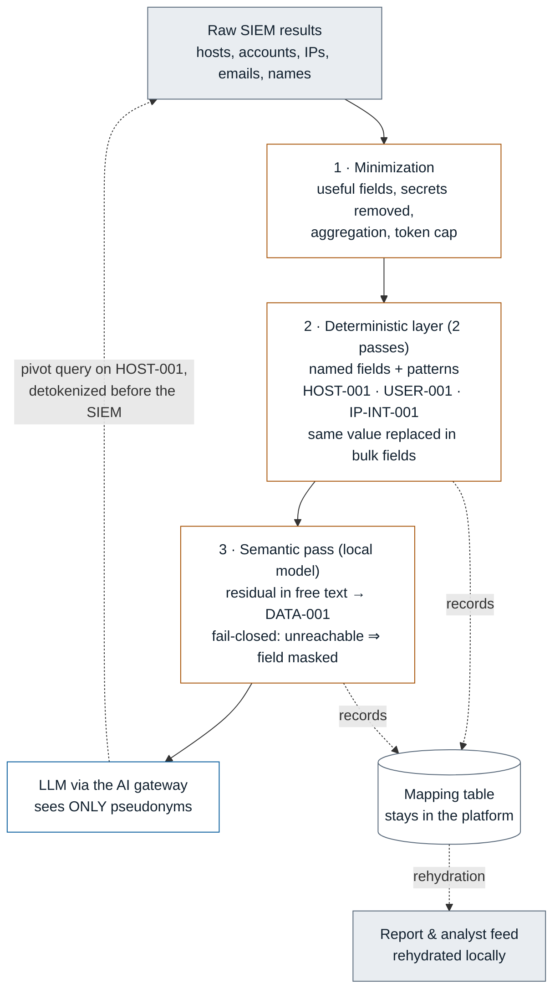
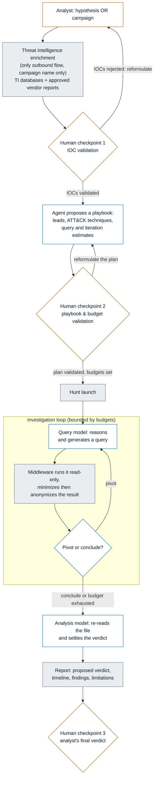

# Flow diagram

Overview of the components and data flows, as implemented in the code.
Reading rule: everything in the internal zone never leaves the perimeter. The logs
are anonymized in the middleware before any send to the reasoning model; the mapping
table never leaves the platform.

## Overview

Three trust zones: the **platform** and the **SIEM/EDR** are two internal systems
of the organization (the logs stay at their host, the platform reads them read-only).
Only two boundaries leave this internal system: **the LLM via the AI gateway** (contractual
boundary with the AI platform team, pseudonyms only) and the **threat intelligence** (public internet, campaign
name only). The ANON anonymizer (local model) is **on-prem, inside the platform**: it has the
right to see the raw data, unlike the reasoning model which only receives pseudonyms.

## Flow of the protected data

This is the heart of the guarantee. A SIEM result crosses three nets before reaching the
reasoning model; the return path (queries, report) is detokenized locally.

Reading: the data descends while being anonymized (nets 1 to 3); only pseudonyms
reach the model. The mapping table (dotted arrows) serves only internally:
rehydrating the report for the analyst, and detokenizing a pivot query before the SIEM.
The model never sees a real value, and could not recover it.

## Course of a hunt

The amber diamonds are the moments where the human decides; the indigo frames are the
model calls; the rest is the platform. During the loop, no outbound tool
exists: enrichment is only possible before launch.

## Identities and secrets

| Target | Technical identity | Exact permission | Where the secret lives |
|---|---|---|---|
| Sentinel | Entra ID app registration | Log Analytics Data.Read + Log Analytics Reader role (per workspace) | Store / Key Vault (`ENTRA_*`) |
| Defender | Entra ID app registration | ThreatHunting.Read.All (application, admin consent) | Store / Key Vault (`ENTRA_*`) |
| SecOps | GCP service account | Chronicle API Viewer (Workload Identity preferred) | Store / Key Vault |
| AI gateway (reasoning) | Platform-dedicated service key | Gateway access, function calling | Store / Key Vault (`GATEWAY_API_KEY`) |
| ANON (anonymization) | Dedicated anonymization key | Local endpoint (OpenAI-compatible) | Store / Key Vault (`ANONYMIZER_API_KEY`) |
| Threat intelligence | Key per source | Search only | Store / Key Vault (`OTX_API_KEY`, etc.) |

The keys are entered in the Configuration screen (write-only, encrypted store
`.secrets.enc`), with a switch to Azure Key Vault in production (`SHL_KEY_VAULT_URL`). The
secrets are never in the clear, never logged, never in a prompt; the front end and the model
never see them.

## What guarantees that the data stays internal

1. **Model registry with no outbound tool**: during the loop, the agent materially has
   no tool whose flow leaves the perimeter. A string read from a
   log cannot become an external request, even on prompt injection.
2. **Enrichment confined to the upstream phase**: `/enrich` is reserved for the analyst and
   refused as soon as the hunt is launched. Only the campaign name leaves, after the anti-leak
   filter (private IPs, identifiers, paths, email addresses, internal DNS suffixes).
3. **Anonymization in depth before any return to the model**: minimization, then the
   deterministic layer (named fields + patterns, in two passes to cover the bulk fields),
   then the ANON semantic pass for the residual in free text. Fail-closed: if the anonymization model
   is unreachable, the free text is masked, never let through. The model never receives
   a real value, and the mapping table does not leave the platform.
4. **The AI gateway transit is the only contractual zone**: the anonymized data
   transits to the model through the platform team's gateway. The guarantee (non-retention,
   non-training, prompt caching included) is a commitment to be confirmed in writing,
   not a property of the code.
